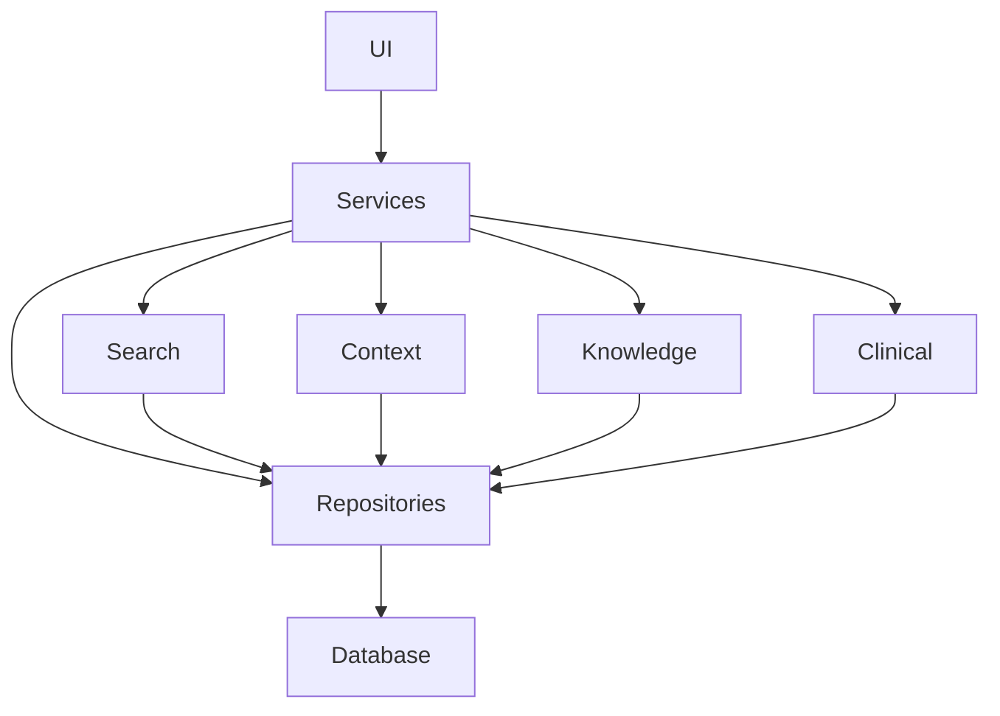
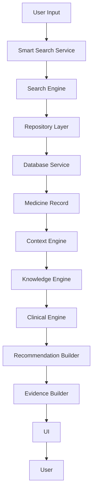
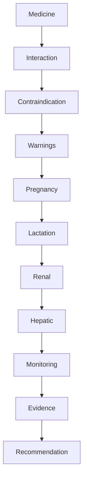
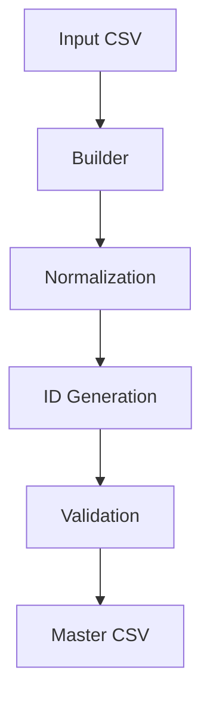

# Pharma AI Architecture
## Enterprise Software Architecture Documentation

---

**Project Name:** Pharma AI

**Document:** Architecture Documentation

**Document ID:** PHARMA-ARCH-001

**Version:** 1.0.0

**Status:** Official

**Author:** Ravi Varsani

**Architecture Review:** ChatGPT (OpenAI)

**Last Updated:** July 2026

---

# Document Classification

| Item | Value |
|------|-------|
| Type | Enterprise Architecture |
| Audience | Developers, Architects, Contributors |
| Project | Pharma AI |
| Language | English |
| Format | Markdown |
| Repository | `/docs/ARCHITECTURE.md` |

---

# Version History

| Version | Date | Description |
|----------|------|-------------|
| 1.0.0 | July 2026 | Initial Enterprise Architecture Documentation |

---

# Purpose

This document defines the official software architecture of Pharma AI.

It explains:

- Overall system architecture
- Module responsibilities
- Layer separation
- Data flow
- Clinical decision workflow
- AI integration strategy
- Development principles
- Future expansion strategy

This document is considered the single source of truth for the software architecture of Pharma AI.

---

# Project Vision

> Build the world's most reliable pharmacist-first Clinical Decision Support System (CDSS) focused on generic medicines.

Pharma AI is designed to evolve beyond a medicine lookup application into a complete clinical intelligence platform that assists pharmacists with evidence-based decision support.

---

# Mission Statement

To provide safe, evidence-based, explainable, and maintainable clinical decision support for generic medicines using modern software engineering principles.

---

# Core Objectives

The primary objectives of Pharma AI are:

- Provide accurate medicine information.
- Support pharmacists during dispensing.
- Deliver evidence-based clinical recommendations.
- Maintain high-quality validated medicine databases.
- Ensure explainable clinical decisions.
- Build an AI-ready architecture.
- Maintain enterprise-grade software quality.

---

# Design Philosophy

Pharma AI follows five core architectural principles.

## 1. Clinical Safety First

Clinical correctness is always more important than software convenience.

Every recommendation must be based on validated data.

---

## 2. Evidence Before Opinion

The system never generates clinical advice without supporting evidence.

Every recommendation should be traceable.

---

## 3. Modular Architecture

Every module has one responsibility.

Modules communicate through clearly defined interfaces.

No hidden dependencies are allowed.

---

## 4. Maintainability

The architecture is designed for long-term maintenance.

Future developers should understand the project without reverse engineering the codebase.

---

## 5. AI Ready

The software architecture prepares Pharma AI for future AI integration without requiring major architectural changes.

AI is an extension layer—not the core decision maker.

---

# Software Philosophy

Pharma AI is built around the following engineering philosophy:

# High-Level System Architecture

Pharma AI follows a layered enterprise architecture where each layer has a single, well-defined responsibility.

The system is designed around the following principles:

- Separation of Concerns
- Low Coupling
- High Cohesion
- Clinical Safety
- Explainable Decision Support
- Future AI Integration

---

# Architecture Overview

```text
                        ┌────────────────────────────┐
                        │         User (UI)          │
                        └─────────────┬──────────────┘
                                      │
                                      ▼
                        ┌────────────────────────────┐
                        │      Presentation Layer    │
                        │     (Streamlit / UI)       │
                        └─────────────┬──────────────┘
                                      │
                                      ▼
                        ┌────────────────────────────┐
                        │      Application Layer     │
                        │     Smart Search Service   │
                        └─────────────┬──────────────┘
                                      │
                                      ▼
                        ┌────────────────────────────┐
                        │       Search Engine        │
                        └─────────────┬──────────────┘
                                      │
                                      ▼
                        ┌────────────────────────────┐
                        │      Context Engine        │
                        └─────────────┬──────────────┘
                                      │
                                      ▼
                        ┌────────────────────────────┐
                        │     Knowledge Engine       │
                        └─────────────┬──────────────┘
                                      │
                                      ▼
                        ┌────────────────────────────┐
                        │      Clinical Engine       │
                        └─────────────┬──────────────┘
                                      │
                                      ▼
                        ┌────────────────────────────┐
                        │     Repository Layer       │
                        └─────────────┬──────────────┘
                                      │
                                      ▼
                        ┌────────────────────────────┐
                        │     Database Service       │
                        └─────────────┬──────────────┘
                                      │
                                      ▼
                        ┌────────────────────────────┐
                        │      CSV Master Data       │
                        └────────────────────────────┘
```

---

# Layered Architecture

The architecture is divided into independent layers.

## Layer 1 — Presentation Layer

Folder

```
pharma_ai/ui/
```

Responsibilities

- User Interface
- Medicine Card
- Search Box
- Clinical Display
- Reports

Rules

- No database access
- No business logic
- No clinical reasoning

---

## Layer 2 — Service Layer

Folder

```
pharma_ai/services/
```

Responsibilities

- Search orchestration
- Database service
- Application services
- Request routing

Rules

- No UI code
- No clinical decision making

---

## Layer 3 — Search Layer

Folder

```
pharma_ai/search/
```

Responsibilities

- Exact search
- Alias search
- Fuzzy search
- Search ranking

Output

Search Result only.

No clinical interpretation.

---

## Layer 4 — Context Layer

Folder

```
pharma_ai/context/
```

Responsibilities

- Patient context
- Medicine context
- Search context
- Clinical context

Purpose

Transform raw search results into contextual information.

---

## Layer 5 — Knowledge Layer

Folder

```
pharma_ai/knowledge/
```

Responsibilities

- Drug knowledge
- Disease knowledge
- Clinical references
- Evidence preparation

Purpose

Provide structured medical knowledge.

---

## Layer 6 — Clinical Layer

Folder

```
pharma_ai/clinical/
```

Responsibilities

- Interaction engine
- Contraindication engine
- Warning engine
- Pregnancy engine
- Lactation engine
- Renal engine
- Hepatic engine
- Monitoring engine
- Evidence engine

Purpose

Generate validated clinical findings.

---

## Layer 7 — Repository Layer

Folder

```
pharma_ai/repositories/
```

Responsibilities

- Data retrieval
- Repository abstraction
- Entity lookup

Rules

Repositories never contain clinical logic.

---

## Layer 8 — Database Layer

Folder

```
pharma_ai/database/
```

Responsibilities

- Production master CSV
- Clinical CSV
- Mapping CSV
- Import templates

Purpose

Persistent validated data storage.

---

# Complete Request Lifecycle

Every request follows the same processing pipeline.

```text
User Input

↓

Normalize Query

↓

Search Engine

↓

Medicine Identification

↓

Database Lookup

↓

Context Generation

↓

Knowledge Retrieval

↓

Clinical Analysis

↓

Evidence Collection

↓

Recommendation

↓

UI Rendering
```

---

# Module Communication Rules

Allowed Communication

```
UI

↓

Services

↓

Search

↓

Repositories

↓

Database
```

```
Services

↓

Clinical

↓

Knowledge

↓

Context
```

---

Forbidden Communication

UI

❌ Database

UI

❌ Repository

Clinical

❌ UI

Builder

❌ UI

Validator

❌ Search

Governance

❌ Database Write

---

# Dependency Direction

Dependencies always point downward.

```
UI

↓

Services

↓

Search

↓

Context

↓

Knowledge

↓

Clinical

↓

Repositories

↓

Database
```

Reverse dependencies are prohibited.

---

# Architectural Benefits

This architecture provides:

- High Maintainability
- Easy Testing
- Module Isolation
- Scalability
- AI Readiness
- Enterprise Stability
- Clinical Safety
- Explainable Decision Support

---

# Architecture Freeze Policy

The following layers are considered stable:

- Core
- Services
- Repositories
- Builders
- Validators
- Governance

Changes to these layers require architectural review.

Future innovation should primarily occur within:

- AI
- Context
- Knowledge
- Clinical
- UI

# Package Structure

The Pharma AI source code is organized using a modular, layered architecture.

```
pharma_ai/

├── ai/
├── builders/
├── clinical/
├── context/
├── core/
├── database/
│   ├── atc/
│   ├── clinical/
│   ├── import_templates/
│   ├── mapping/
│   ├── medicine/
│   ├── product/
│   └── input/
│
├── governance/
├── knowledge/
├── models/
├── repositories/
├── search/
├── services/
├── ui/
├── validator/
└── utils/
```

Every package has one clearly defined responsibility.

---

# Package Responsibilities

| Package | Responsibility |
|----------|----------------|
| ai | AI integration and reasoning |
| builders | Production database builders |
| clinical | Clinical decision support engines |
| context | Context generation |
| core | Shared core infrastructure |
| database | Production datasets |
| governance | Release governance |
| knowledge | Structured medical knowledge |
| models | Shared data models |
| repositories | Repository abstraction |
| search | Search algorithms |
| services | Application services |
| ui | User interface |
| validator | Data validation |
| utils | Shared helper utilities |

---

# Package Dependency Matrix

The following dependency matrix defines which packages may communicate.

| Package | Allowed Dependencies |
|----------|----------------------|
| ui | services |
| services | search, repositories, context, clinical |
| search | repositories |
| context | repositories, knowledge |
| knowledge | repositories |
| clinical | repositories, knowledge |
| repositories | database |
| validator | database |
| builders | database |
| governance | validator |

---

# Forbidden Dependencies

The following direct dependencies are prohibited.

```
ui
   ↓
database
```

```
ui
   ↓
builder
```

```
clinical
   ↓
ui
```

```
repository
   ↓
ui
```

```
builder
   ↓
clinical
```

```
validator
   ↓
ui
```

```
governance
   ↓
database write
```

Violating these rules creates unnecessary coupling and reduces maintainability.

---

# Module Responsibility Matrix

## UI Module

Responsibilities

- Render interface
- Display medicine card
- Display findings
- Collect user input

Must Never

- Read CSV
- Apply clinical rules
- Generate recommendations

---

## Services Module

Responsibilities

- Coordinate requests
- Connect modules
- Return application responses

Must Never

- Render UI
- Store data

---

## Search Module

Responsibilities

- Medicine lookup
- Alias lookup
- Ranking
- Search pipeline

Must Never

- Clinical reasoning
- Recommendation generation

---

## Context Module

Responsibilities

- Build runtime context
- Prepare patient context
- Prepare medicine context

Must Never

- Search database directly

---

## Knowledge Module

Responsibilities

- Structured medical knowledge
- Evidence preparation
- Guideline mapping

Must Never

- UI rendering
- Search

---

## Clinical Module

Responsibilities

- Execute clinical engines
- Generate findings
- Calculate recommendations

Must Never

- Access UI
- Read CSV directly

---

## Repository Module

Responsibilities

- Retrieve data
- Hide storage implementation
- Provide entity lookup

Must Never

- Apply business rules

---

## Builder Module

Responsibilities

- Import data
- Normalize data
- Generate master CSV

Must Never

- Execute clinical logic

---

## Validator Module

Responsibilities

- Validate datasets
- Calculate health score
- Generate reports

Must Never

- Modify production data

---

## Governance Module

Responsibilities

- Evaluate release quality
- Apply release policy
- Produce release decision

Must Never

- Modify application behavior

---

# Mermaid Package Diagram



---

# Module Ownership

Each package has exactly one primary responsibility.

```
UI

↓

Presentation
```

```
Services

↓

Application Logic
```

```
Search

↓

Medicine Identification
```

```
Context

↓

Runtime Context
```

```
Knowledge

↓

Medical Knowledge
```

```
Clinical

↓

Clinical Decision Support
```

```
Repositories

↓

Data Access
```

```
Database

↓

Persistent Data
```

This ownership model minimizes coupling and simplifies maintenance.

---

# Package Design Rules

Every package should satisfy the following rules:

- One responsibility
- Explicit public interface
- No hidden dependencies
- Unit-test friendly
- Independent development
- Independent documentation
- Minimal coupling
- High cohesion

---

# Enterprise Design Principles

The package architecture follows:

- Clean Architecture
- SOLID Principles
- Layered Architecture
- Domain Separation
- Repository Pattern
- Builder Pattern
- Validation Pipeline
- Governance Pipeline

These principles should remain stable throughout the lifetime of the project.

---

# Architecture Stability Levels

| Package | Stability |
|----------|-----------|
| core | Very High |
| repositories | Very High |
| services | Very High |
| validator | Very High |
| governance | Very High |
| builders | High |
| search | High |
| context | Medium |
| knowledge | Medium |
| clinical | Medium |
| ai | Evolving |
| ui | Evolving |

Future development should prioritize extending evolving packages rather than modifying stable core packages.
# Runtime Data Flow

This chapter describes how data moves through the Pharma AI platform during runtime.

The architecture follows a one-way processing pipeline.

```
User

↓

Search

↓

Context

↓

Knowledge

↓

Clinical Analysis

↓

Recommendation

↓

Presentation
```

Each layer has a clearly defined responsibility.

No layer bypasses another layer.

---

# End-to-End Runtime Flow



---

# Search Flow

The Search Engine is responsible only for medicine identification.

It never performs clinical reasoning.

## Search Pipeline

```text
User Query

↓

Normalize

↓

Alias Search

↓

Exact Search

↓

Brand Search

↓

Generic Search

↓

Combination Search

↓

Fuzzy Search

↓

Ranking

↓

Best Match
```

---

## Search Responsibilities

Search Engine is responsible for

- Query normalization
- Alias resolution
- Brand lookup
- Generic lookup
- Combination lookup
- Fuzzy matching
- Result ranking

Search Engine never performs

- Dose adjustment
- Drug interaction
- Clinical recommendation
- Evidence evaluation

---

# Repository Flow

Repositories abstract the underlying database.

```text
Clinical Engine

↓

Repository

↓

Database Service

↓

CSV Master

↓

Repository

↓

Clinical Engine
```

Benefits

- Storage independence
- Easier testing
- Lower coupling

---

# Context Flow

The Context Layer transforms raw data into meaningful runtime context.

```text
Medicine

↓

Patient Context

↓

Medicine Context

↓

Clinical Context

↓

Context Object
```

The Context Layer does not make decisions.

It prepares information for downstream processing.

---

# Knowledge Flow

Knowledge Layer converts validated data into structured knowledge.

```text
Database

↓

Drug Knowledge

↓

Evidence

↓

Guidelines

↓

Knowledge Object
```

Knowledge is reusable across multiple clinical engines.

---

# Clinical Flow

Clinical processing follows a deterministic pipeline.



Each engine produces independent findings.

The Recommendation Builder combines all findings.

---

# Clinical Engine Responsibilities

Each engine performs one responsibility.

Example

Interaction Engine

- Detect interactions

Pregnancy Engine

- Evaluate pregnancy safety

Renal Engine

- Evaluate renal dosing

Monitoring Engine

- Suggest monitoring parameters

No engine performs another engine's task.

---

# Recommendation Flow

Recommendations are generated only after all engines complete.

```text
Clinical Findings

↓

Severity Assessment

↓

Evidence Mapping

↓

Recommendation Builder

↓

Clinical Recommendation
```

Benefits

- Consistent output
- Explainable decisions
- Easier testing

---

# Evidence Flow

Evidence supports every clinical finding.

```text
Finding

↓

Evidence Level

↓

Reference

↓

Clinical Recommendation
```

No recommendation should exist without supporting evidence where available.

---

# Builder Flow

Builders transform raw datasets into production-ready master data.



Builder Responsibilities

- Import
- Normalize
- Validate
- Export

Builders never execute clinical logic.

---

# Validation Flow

Validation ensures production quality.

```text
Master CSV

↓

Schema Validation

↓

Missing Values

↓

Duplicate Check

↓

Foreign Keys

↓

Business Rules

↓

Health Score
```

Validation must complete before release.

---

# Governance Flow

Governance determines release readiness.

```text
Validation

↓

Audit

↓

Governance Rules

↓

Release Decision

↓

Approved Release
```

Governance never modifies application data.

---

# UI Flow

Presentation is the final layer.

```text
Recommendation

↓

Medicine Card

↓

Clinical Tabs

↓

Alerts

↓

User
```

The UI renders information only.

No business logic should exist in the presentation layer.

---

# Runtime Principles

Every runtime request follows these principles.

1. One Direction Data Flow

Data always moves downward.

---

2. Stateless Processing

Processing should not depend on previous requests.

---

3. Layer Isolation

Every layer communicates only through defined interfaces.

---

4. Deterministic Results

The same input should produce the same output when the database is unchanged.

---

5. Explainability

Every recommendation should be explainable using evidence and clinical findings.

---

# Runtime Safety Rules

The following rules are mandatory.

✓ Search never performs clinical reasoning.

✓ Clinical engines never access the UI.

✓ UI never accesses CSV files.

✓ Builders never generate recommendations.

✓ Validators never modify production data.

✓ Governance never changes business logic.

These rules preserve long-term architectural stability.

# Enterprise Design Rules

The following architectural rules are mandatory throughout the Pharma AI codebase.

These rules ensure long-term maintainability, scalability, and clinical safety.

---

## Rule 1 — Single Responsibility

Every module must have exactly one primary responsibility.

Examples:

- Search identifies medicines.
- Clinical evaluates findings.
- Repository retrieves data.
- UI renders information.

---

## Rule 2 — Layer Separation

Every layer communicates only with its adjacent layer.

Example

```
UI

↓

Services

↓

Repositories

↓

Database
```

Direct communication between non-adjacent layers is prohibited.

---

## Rule 3 — Dependency Direction

Dependencies always point downward.

```
Presentation

↓

Application

↓

Domain

↓

Infrastructure
```

Reverse dependencies are not allowed.

---

## Rule 4 — Clinical Safety

Clinical recommendations must originate only from validated clinical engines.

The UI, Search Layer, and Database Layer must never generate clinical advice.

---

## Rule 5 — Explainability

Every recommendation should be explainable.

Each recommendation should include, where available:

- Clinical Finding
- Severity
- Evidence
- Guideline
- Reference

---

## Rule 6 — Data Integrity

Only validated production data may be used during runtime.

Input datasets must never be used directly.

---

## Rule 7 — Immutability

Clinical findings should be treated as immutable.

They should not be modified after generation.

---

# Coding Standards

All source code must follow the project coding standards.

## Python Version

Python 3.14+

---

## Naming Convention

### Classes

PascalCase

Example

```
ClinicalEngine
MedicineRepository
SearchEngine
```

---

### Functions

snake_case

Example

```
search_medicine()

load_database()

calculate_health_score()
```

---

### Variables

snake_case

Example

```
generic_name

clinical_result

interaction_score
```

---

### Constants

UPPER_CASE

Example

```
MAX_RESULTS

SEARCH_THRESHOLD

DATABASE_VERSION
```

---

## Type Hints

Public APIs should use explicit type hints.

Example

```python
def search(query: str) -> SearchResult:
    ...
```

---

## Logging

Use the standard logging framework.

Avoid print statements in production code.

Preferred

```python
logger.info(...)

logger.warning(...)

logger.error(...)
```

---

# Documentation Standards

Every public class should contain:

- Purpose
- Parameters
- Returns
- Raises
- Example

Every module should include:

- Overview
- Responsibilities
- Dependencies

---

# Error Handling Policy

Expected errors should be handled gracefully.

Unexpected errors should:

- Be logged
- Preserve stack trace
- Return safe responses

Silent failures are prohibited.

---

# Performance Guidelines

Performance optimization should be evidence-based.

Optimization requires:

- Benchmark
- Measurement
- Regression testing

Avoid premature optimization.

---

# Testing Strategy

Every significant change should pass:

- Unit Tests
- Integration Tests
- Validation
- Audit
- Streamlit Test
- AI Test

No production release should bypass testing.

---

# Extension Guidelines

New functionality should extend the architecture without modifying stable components whenever possible.

Preferred extension points:

- AI
- Clinical
- Knowledge
- Context
- UI

Avoid modifying stable infrastructure unless required.

---

# Architecture Decision Records (ADR)

Major architectural decisions should be documented.

Suggested ADR structure:

```
ADR-001
Title

Context

Decision

Consequences
```

Example topics:

- Repository Pattern
- Builder Pattern
- CSV Storage
- Clinical Engine Pipeline
- Governance Model

---

# Versioning Policy

The project follows Semantic Versioning.

```
MAJOR.MINOR.PATCH
```

Example

```
19.0.0

18.7.2

18.5.1
```

Definitions

Major

Architecture changes

Minor

New features

Patch

Bug fixes

---

# Release Process

Every production release follows:

```
Development

↓

Compile

↓

Validation

↓

Audit

↓

Regression Test

↓

Streamlit Test

↓

AI Test

↓

Git Commit

↓

Git Tag

↓

Release
```

No release may skip validation.

---

# Architecture Decision Matrix

| Change Type | Design Review Required |
|-------------|------------------------|
| Bug Fix | No |
| Performance Optimization | No (unless architecture changes) |
| New Clinical Engine | Yes |
| New Builder | Yes |
| New Database Schema | Yes |
| AI Architecture Change | Yes |
| Repository Interface Change | Yes |
| Public API Change | Yes |

---

# Future Architecture Roadmap

## Phase 18.5

Engineering Hardening

- Stability
- Performance
- Documentation

---

## Phase 18.6

Testing

- Benchmarking
- Regression
- Documentation Completion

---

## Phase 18.7

Release Candidate

- Final Validation
- Production Readiness

---

## Phase 19

AI Clinical Pharmacist

- Clinical Reasoning
- Explainable AI
- Offline LLM
- Prescription Review

---

## Phase 20

Enterprise Edition

- Multi-user
- Authentication
- Hospital Integration
- APIs
- Cloud Deployment

---

# Architecture Summary

Pharma AI is designed as a modular, layered, evidence-based Clinical Decision Support System.

Its architecture emphasizes:

- Clinical safety
- Maintainability
- Scalability
- Explainability
- Enterprise software engineering
- AI readiness

The architecture is intended to remain stable while allowing future innovation through clearly defined extension points.

---

# Approval

Document Status:

**Approved**

Version:

**1.0.0**

Owner:

**Pharma AI Project**

Document Location:

```
docs/ARCHITECTURE.md
```

This document serves as the official architectural reference for all future development of Pharma AI.