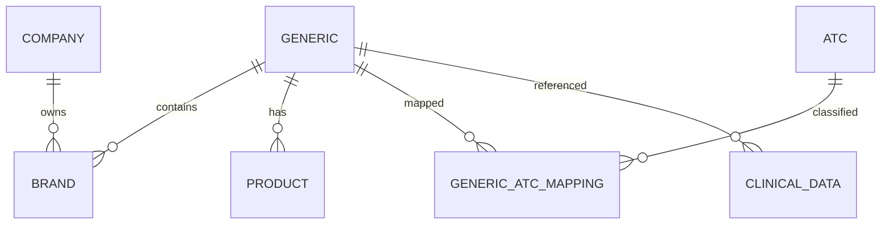

# Pharma AI Database Design
## Enterprise Database Documentation

---

**Project Name:** Pharma AI

**Document:** Database Design Documentation

**Document ID:** PHARMA-DB-001

**Version:** 1.0.0

**Status:** Official

**Author:** Ravi Varsani

**Last Updated:** July 2026

---

# Document Classification

| Item | Value |
|------|-------|
| Type | Enterprise Database Documentation |
| Project | Pharma AI |
| Audience | Developers, Data Engineers, Clinical Team |
| Language | English |
| Format | Markdown |
| Repository | docs/DATABASE.md |

---

# Purpose

This document defines the official database architecture of Pharma AI.

It describes:

- Database philosophy
- Folder structure
- Production datasets
- Clinical datasets
- Mapping datasets
- Data relationships
- ID standards
- Versioning strategy
- Data lifecycle
- Golden Dataset strategy

This document is the single source of truth for all Pharma AI database-related development.

---

# Database Philosophy

Pharma AI follows a **CSV-first production database architecture**.

The database is designed around these principles:

- Human readable
- Version controlled
- Builder generated
- Validator protected
- Audit verified
- AI ready

Production data is always generated through builders.

Manual editing of production master files is prohibited.

---

# Database Objectives

The database architecture is designed to provide:

- Data integrity
- Clinical safety
- Easy maintenance
- High transparency
- Version tracking
- Explainable AI support

---

# Database Layers

The Pharma AI database is divided into multiple logical layers.

```
Import Templates

↓

Input Data

↓

Builders

↓

Master Database

↓

Repositories

↓

Clinical Engine

↓

AI
```

Each layer has a single responsibility.

---

# Folder Structure

```
pharma_ai/database/

├── atc/
├── clinical/
│   ├── contraindication/
│   ├── evidence/
│   ├── hepatic/
│   ├── interaction/
│   ├── lactation/
│   ├── monitoring/
│   ├── pregnancy/
│   ├── renal/
│   ├── side_effect/
│   └── warning/
│
├── import_templates/
├── input/
├── mapping/
├── medicine/
├── product/
└── reports/
```

---

# Database Categories

The database is divided into six primary categories.

## Medicine Database

Contains

- Generic Master
- Brand Master
- Company Master

---

## Product Database

Contains

- Product Master

---

## ATC Database

Contains

- ATC Master

---

## Mapping Database

Contains

- Generic ↔ ATC
- Generic ↔ Class
- Other future mappings

---

## Clinical Database

Contains

- Drug Interaction
- Contraindication
- Warning
- Side Effect
- Pregnancy
- Lactation
- Renal
- Hepatic
- Monitoring
- Evidence

---

## Import Layer

Contains

- Import Templates
- Builder Input Files

No runtime module reads data directly from this layer.

---

# Database Design Principles

The Pharma AI database follows these design principles.

## Single Source of Truth

Every entity exists only once.

Example

Generic Master

↓

Referenced everywhere

Never duplicated.

---

## Normalized Data

Reference information is stored only once.

Relationships are created using mapping tables.

---

## Immutable Production Data

Master datasets should never be edited manually.

All production data must be regenerated through builders.

---

## Validation First

Every master dataset must pass validation before use.

---

## Audit Before Release

Every production dataset must pass database audit before release.

---

# Data Flow

```
Import Template

↓

Input CSV

↓

Builder

↓

Validation

↓

Audit

↓

Master CSV

↓

Repository

↓

Runtime
```

No shortcuts are permitted.

---

# Production Data Policy

Production master CSV files represent validated system data.

They should:

- Never be edited manually.
- Always be version controlled.
- Always be builder generated.
- Always be validator approved.

---

# Runtime Policy

Runtime components must read only validated production master datasets.

Input datasets are never accessed during runtime.

---

# Database Scope

This document covers:

- Folder structure
- Data organization
- Master datasets
- Clinical datasets
- Mapping strategy
- ID system
- Versioning

Implementation details are documented separately.

# Master Data Model

The Pharma AI production database is organized around a normalized master data model.

Each entity has a single authoritative master dataset.

No master data should be duplicated.

---

# Core Master Tables

The following master tables form the foundation of the Pharma AI database.

| Master Table | Purpose |
|--------------|---------|
| generic_master.csv | Generic medicine master |
| company_master.csv | Manufacturer master |
| brand_master.csv | Brand master |
| product_master.csv | Product master |
| atc_master.csv | WHO ATC classification |
| generic_atc_mapping.csv | Generic → ATC mapping |
| generic_class_mapping.csv | Generic → Therapeutic class mapping |

These datasets are considered production master tables.

---

# Generic Master

Purpose

Stores every generic medicine exactly once.

Responsibilities

- Generic identity
- Generic name
- Normalized name
- Combination detection
- Metadata

Primary Key

```
Generic_ID
```

Example

```
GEN000001
```

Referenced By

- Product Master
- Brand Master
- Clinical Tables
- Mapping Tables

---

# Company Master

Purpose

Stores manufacturer information.

Primary Key

```
Company_ID
```

Example

```
CMP000001
```

Referenced By

- Brand Master
- Product Master

---

# Brand Master

Purpose

Stores commercial medicine brands.

Primary Key

```
Brand_ID
```

Foreign Keys

```
Generic_ID

Company_ID
```

Relationships

```
Brand

↓

Generic

↓

Company
```

---

# Product Master

Purpose

Stores dispensable products.

Primary Key

```
Product_ID
```

Foreign Keys

```
Generic_ID
```

Typical Information

- Product Name
- Strength
- Dosage Form
- Route
- Pack Size
- Unit
- Manufacturer
- PMBJK Code
- HSN Code
- GST Rate
- Schedule
- Storage

---

# ATC Master

Purpose

Stores WHO ATC Classification.

Primary Key

```
ATC_ID
```

Example

```
ATC000001
```

Hierarchy

```
Level 1

↓

Level 2

↓

Level 3

↓

Level 4

↓

Level 5
```

---

# Mapping Tables

Mapping tables connect master entities.

Examples

```
Generic

↓

ATC
```

```
Generic

↓

Therapeutic Class
```

Mappings eliminate duplicate information.

---

# Entity Relationships

```
Company

↓

Brand

↓

Generic

↓

Product

↓

Clinical Data
```

Generic medicine is the central entity.

---

# Entity Relationship Diagram



---

# ID Standards

Every production entity receives a permanent identifier.

| Entity | Prefix |
|---------|---------|
| Generic | GEN |
| Company | CMP |
| Brand | BRD |
| Product | PRD |
| ATC | ATC |
| Mapping | MAP |
| Interaction | INT |
| Contraindication | CON |
| Warning | WRN |
| Side Effect | SID |
| Pregnancy | PRG |
| Lactation | LAC |
| Renal | REN |
| Hepatic | HEP |
| Monitoring | MON |
| Evidence | EVD |

IDs are immutable.

IDs must never be reused.

---

# ID Generation Rules

Every ID must:

- Be unique
- Be permanent
- Never change
- Never be recycled

Example

```
GEN000001

GEN000002

GEN000003
```

Deleted IDs are not reassigned.

---

# Foreign Key Rules

All foreign keys must reference an existing master record.

Example

```
Brand

↓

Generic_ID

↓

generic_master.csv
```

Invalid references are prohibited.

Validators must reject orphan records.

---

# Referential Integrity

The following relationships are mandatory.

```
Brand

↓

Generic
```

```
Product

↓

Generic
```

```
Mapping

↓

Generic
```

```
Mapping

↓

ATC
```

No dangling references are allowed.

---

# Naming Standards

Entity names should follow standardized normalization.

Examples

```
Paracetamol

Metformin

Pantoprazole
```

Combination medicines should preserve separators.

Examples

```
Aceclofenac + Paracetamol

Telmisartan + Hydrochlorothiazide
```

Normalization rules are implemented within Builder modules.

---

# Data Ownership

Each dataset has one owner.

| Dataset | Owner |
|----------|-------|
| Import Templates | Builder Framework |
| Input Files | Data Engineering |
| Master CSV | Builder Output |
| Runtime Access | Repository Layer |
| Validation Reports | Validator |
| Audit Reports | Governance |

Ownership should never overlap.

---

# Database Integrity Principles

The Pharma AI database follows five integrity rules.

1. Unique Primary Keys

2. Valid Foreign Keys

3. No Duplicate Master Records

4. Validated Before Runtime

5. Audited Before Release

Violation of any rule blocks production release.

# Clinical Database Architecture

The Clinical Database is the core knowledge repository of Pharma AI.

It stores validated clinical information used by the Clinical Engine to generate evidence-based recommendations.

Unlike medicine master data, clinical data is dynamic and may evolve as new clinical evidence becomes available.

---

# Clinical Database Structure

```
database/

└── clinical/

    ├── interaction/
    ├── contraindication/
    ├── warning/
    ├── side_effect/
    ├── pregnancy/
    ├── lactation/
    ├── renal/
    ├── hepatic/
    ├── monitoring/
    └── evidence/
```

Each module owns exactly one clinical domain.

---

# Clinical Database Philosophy

Clinical data should be:

- Evidence-based
- Version controlled
- Builder generated
- Validator protected
- Human readable
- Explainable

Clinical information must never be generated dynamically without validation.

---

# Clinical Dataset Categories

| Module | Purpose |
|----------|---------|
| Interaction | Drug-drug interactions |
| Contraindication | Absolute & relative contraindications |
| Warning | Precautions and warnings |
| Side Effect | Adverse drug reactions |
| Pregnancy | Pregnancy safety |
| Lactation | Breastfeeding safety |
| Renal | Renal dose adjustment |
| Hepatic | Hepatic dose adjustment |
| Monitoring | Monitoring recommendations |
| Evidence | References and evidence levels |

---

# Clinical Entity Relationship

```
Generic Medicine

        │

        ├── Interaction

        ├── Contraindication

        ├── Warning

        ├── Side Effect

        ├── Pregnancy

        ├── Lactation

        ├── Renal

        ├── Hepatic

        ├── Monitoring

        └── Evidence
```

Every clinical dataset references a Generic Medicine.

---

# Generic-Centric Design

Pharma AI stores clinical information at the Generic Medicine level.

Example

```
Paracetamol

↓

Warnings

↓

Pregnancy

↓

Renal

↓

Monitoring
```

Clinical recommendations are therefore independent of commercial brands.

---

# Drug Interaction Database

Purpose

Store clinically significant drug-drug interactions.

Primary Fields

- Interaction_ID
- Generic_A
- Generic_B
- Severity
- Mechanism
- Clinical_Effect
- Management
- Evidence_Level
- Primary_Reference

Example

```
Paracetamol

+

Warfarin

↓

Moderate Interaction
```

---

# Contraindication Database

Purpose

Store diseases or clinical situations where a medicine should not be used.

Typical Fields

- Contraindication_ID
- Generic_Name
- Condition
- Severity
- Recommendation
- Evidence_Level

---

# Warning Database

Purpose

Store precautions before prescribing or dispensing.

Examples

- Elderly
- Liver disease
- Alcohol use
- Dehydration

Warnings do not necessarily prohibit use.

---

# Side Effect Database

Purpose

Store adverse drug reactions.

Categories may include

- Common
- Uncommon
- Rare
- Serious

Severity should be standardized across the project.

---

# Pregnancy Database

Purpose

Store pregnancy safety recommendations.

Typical Information

- Pregnancy Risk
- Clinical Recommendation
- Trimester Notes
- Evidence

---

# Lactation Database

Purpose

Store breastfeeding recommendations.

Typical Information

- Compatible
- Use with caution
- Avoid
- Monitoring Advice

---

# Renal Database

Purpose

Store renal dose adjustment recommendations.

Typical Information

- Renal Stage
- Dose Adjustment
- Recommendation
- Monitoring

---

# Hepatic Database

Purpose

Store hepatic dose adjustment recommendations.

Typical Information

- Child-Pugh Category
- Dose Recommendation
- Monitoring
- Contraindications

---

# Monitoring Database

Purpose

Provide pharmacist monitoring recommendations.

Examples

- Liver Function Test
- Serum Creatinine
- Blood Pressure
- Blood Glucose
- INR
- ECG

---

# Evidence Database

Purpose

Store references supporting clinical recommendations.

Typical Fields

- Evidence_ID
- Generic_Name
- Topic
- Evidence_Level
- Reference
- Guideline
- DOI / PMID (optional)
- Notes

Evidence is shared across multiple clinical modules.

---

# Clinical Data Flow

```
Clinical Master CSV

↓

Repository Layer

↓

Clinical Engine

↓

Clinical Findings

↓

Recommendation Builder

↓

Medicine Card
```

Clinical datasets are never accessed directly by the UI.

---

# Clinical Data Standards

Every clinical dataset should follow common principles.

Required Metadata

- Status
- Created At
- Updated At
- Source
- Version

Common Benefits

- Uniform validation
- Easier builders
- Consistent repositories
- Predictable APIs

---

# Clinical Integrity Rules

The following rules apply to every clinical dataset.

✓ Generic Medicine must exist.

✓ Required fields must be present.

✓ Severity must use approved values.

✓ Evidence level must follow project standards.

✓ References should be traceable whenever available.

---

# Clinical Severity Standard

Recommended severity levels:

```
Critical

Major

Moderate

Minor

Information
```

All clinical builders and validators should use the same severity definitions.

---

# Clinical Runtime Policy

At runtime:

Clinical CSV

↓

Repository

↓

Clinical Engine

↓

Finding Object

↓

Recommendation

↓

UI

Clinical engines should never read CSV files directly.

Repositories remain the only supported data access layer.

# Builder Pipeline

The Pharma AI production database is generated through a controlled Builder Pipeline.

No production master dataset is created manually.

Every production dataset must be generated using an approved Builder.

---

# Production Data Pipeline

```text
Import Template

↓

Input CSV

↓

Builder

↓

Normalization

↓

ID Generation

↓

Business Rules

↓

Master CSV

↓

Validation

↓

Audit

↓

Production Release
```

Each stage has a clearly defined responsibility.

---

# Import Template Layer

Folder

```
database/import_templates/
```

Purpose

Provide standardized templates for importing raw datasets.

Characteristics

- Read-only
- Version controlled
- Never modified during runtime
- Defines official schema

Import templates act as the contract between external data and Pharma AI builders.

---

# Input Layer

Folder

```
database/input/
```

Purpose

Store raw datasets before processing.

Characteristics

- Editable
- Human maintained
- Builder input only
- Never used during runtime

Input files may contain incomplete or inconsistent data.

Builders are responsible for transforming them into production-quality datasets.

---

# Builder Layer

Folder

```
pharma_ai/builders/
```

Purpose

Convert raw datasets into validated production datasets.

Builder Responsibilities

- Read input
- Normalize values
- Generate IDs
- Remove duplicates
- Standardize metadata
- Export master CSV

Builders never perform clinical decision making.

---

# Data Normalization

Normalization ensures consistency across all datasets.

Typical operations include:

- Trim whitespace
- Standardize capitalization
- Normalize medicine names
- Preserve combination separators
- Normalize dosage forms
- Normalize routes

Normalization rules should be shared across builders whenever possible.

---

# ID Generation

Every production entity receives a permanent identifier.

Examples

```
GEN000001

CMP000001

BRD000001

PRD000001

ATC000001

MAP000001
```

Rules

- IDs are generated only once.
- IDs never change.
- Deleted IDs are never reused.

---

# Metadata Generation

Every production record should include common metadata.

Typical fields

- Status
- created_at
- updated_at
- source
- version

Metadata improves traceability and auditing.

---

# Master CSV Generation

After normalization and validation, builders generate production master datasets.

Characteristics

- Builder generated
- Read-only during runtime
- Version controlled
- Validator approved

Master datasets become the official runtime database.

---

# Validation Pipeline

Every generated dataset passes through validation before release.

Validation sequence

```text
Required Columns

↓

Missing Values

↓

Duplicate Records

↓

Foreign Keys

↓

Business Rules

↓

Metadata Validation

↓

Health Score
```

Any critical validation failure blocks production release.

---

# Validation Categories

## Structural Validation

Checks:

- Required columns
- Column order (if enforced)
- Data types (where applicable)

---

## Data Validation

Checks:

- Missing values
- Duplicate IDs
- Duplicate entities
- Invalid references

---

## Business Validation

Checks project-specific rules.

Examples

- Valid severity values
- Valid evidence levels
- Valid pregnancy categories
- Valid ATC format
- Valid mapping relationships

---

# Health Score

Validation results are summarized into a Health Score.

Typical evaluation areas

- Schema
- Missing values
- Duplicate records
- Foreign keys
- Business rules
- Metadata

The Health Score provides a quick assessment of production readiness.

---

# Audit Pipeline

After validation, datasets undergo a database audit.

Audit objectives

- Verify integrity
- Verify consistency
- Verify relationships
- Verify production readiness

Audit reports should be stored separately from production data.

---

# Production Release Pipeline

Only validated and audited datasets may be released.

```text
Builder

↓

Validator

↓

Audit

↓

Governance

↓

Release Approval

↓

Production Database
```

Skipping any stage is prohibited.

---

# Builder Design Rules

Every builder should:

- Have one responsibility
- Produce deterministic output
- Be idempotent
- Generate reproducible datasets
- Log important events

Builders should never depend on UI components.

---

# Validation Rules

Validators should:

- Never modify data
- Only report findings
- Fail fast on critical issues
- Produce reproducible reports

Validation should remain independent of builders.

---

# Audit Rules

Audit modules should:

- Read production datasets
- Generate quality metrics
- Calculate health score
- Produce reports

Audits should never modify production data.

---

# Production Readiness Checklist

Before a dataset is released:

✓ Builder completed successfully

✓ Validation passed

✓ Audit passed

✓ Health Score acceptable

✓ Governance approved

✓ Version updated

✓ Changelog updated

Only then may the dataset become part of the production database.

---

# Engineering Principles

The Pharma AI production pipeline follows:

- Builder Pattern
- Validation First
- Audit Before Release
- Governance Controlled Release
- Immutable Production Data
- Full Traceability

These principles ensure long-term maintainability and clinical reliability.

# Golden Dataset Strategy

The Golden Dataset represents the official production-quality medicine database used by Pharma AI.

It serves as the foundation for:

- Search
- Clinical Decision Support
- AI Reasoning
- Validation
- Governance

The Golden Dataset is the only approved source for runtime clinical operations.

---

# Objectives

The Golden Dataset is designed to ensure:

- High-quality medicine data
- Consistent clinical information
- Stable identifiers
- Reproducible releases
- Explainable AI responses

---

# Golden Dataset Lifecycle

```text
Data Collection

↓

Data Verification

↓

Import Template

↓

Input CSV

↓

Builder

↓

Validation

↓

Audit

↓

Governance Approval

↓

Golden Dataset

↓

Runtime
```

Each stage is mandatory.

---

# Golden Dataset Rules

## Rule 1

Only Builder-generated master datasets may become part of the Golden Dataset.

---

## Rule 2

Every dataset must pass:

- Validation
- Audit
- Governance

---

## Rule 3

Every release receives a version.

---

## Rule 4

Every release is reproducible.

---

## Rule 5

No manual editing of production master files.

---

# Dataset Versioning

Every production dataset must contain version metadata.

Example

```
version = 1.0

source = Pharma AI

created_at

updated_at

status
```

Version information must remain synchronized across all production datasets.

---

# Database Version Policy

Major Version

Structural database changes.

Examples

- New schema
- Breaking changes

---

Minor Version

New production datasets.

Examples

- New medicines
- New clinical information

---

Patch Version

Corrections.

Examples

- Typographical fixes
- Clinical reference updates
- Duplicate removal

---

# Release Numbering

Example

```
Database

1.0.0

↓

1.1.0

↓

1.1.1

↓

2.0.0
```

---

# Backup Strategy

Every production release should generate backups.

Recommended structure

```
database/

archive/

2026/

2026-07-15/

medicine/

clinical/

mapping/
```

Backups should be immutable.

---

# Recovery Policy

Recovery should restore:

- Master CSV
- Mapping Tables
- Clinical Data
- Metadata
- Validation Reports
- Audit Reports

Recovery must always restore a complete database snapshot.

---

# Migration Policy

Database migrations should:

- Preserve IDs
- Preserve relationships
- Preserve metadata
- Preserve audit history

Migration must never invalidate production identifiers.

---

# Release Policy

Every production release requires:

✓ Successful Builder execution

✓ Validation PASS

✓ Audit PASS

✓ Governance Approval

✓ Updated Documentation

✓ Updated CHANGELOG

✓ Git Tag

---

# Data Integrity Policy

The following integrity constraints are mandatory.

## Primary Keys

Unique

Permanent

Immutable

---

## Foreign Keys

Validated

Non-null where required

Referentially correct

---

## Metadata

Every production dataset must include:

- Status
- Source
- Version
- Created At
- Updated At

---

# Database Freeze Policy

The following production datasets are considered stable.

- Generic Master
- Company Master
- Brand Master
- Product Master
- ATC Master
- Mapping Tables

Changes require:

- Design Review
- Validation
- Audit

---

# Runtime Database Rules

Runtime components may only access:

```
Master CSV

↓

Repository

↓

Service Layer
```

Runtime components must never access:

- Import Templates
- Input CSV
- Temporary Files

---

# Data Governance

Database governance ensures:

- Traceability
- Quality
- Integrity
- Compliance
- Version Control

Governance decisions are independent of Builder implementation.

---

# Future Database Roadmap

## Phase 18.5

Engineering Hardening

- Documentation
- Validation Improvements
- Audit Improvements

---

## Phase 18.6

Testing

- Benchmarking
- Regression

---

## Phase 18.7

Release Candidate

- Database Freeze
- Production Certification

---

## Phase 19

Clinical Intelligence

- Expanded Clinical Knowledge
- AI Integration
- Structured Evidence
- Knowledge Graph Preparation

---

## Phase 20

Enterprise Platform

- API Support
- Multiple Database Providers
- Cloud Synchronization
- Hospital Integration

---

# Database Design Summary

The Pharma AI database is designed around four core principles.

1. Builder Generated

↓

2. Validator Protected

↓

3. Governance Approved

↓

4. Runtime Safe

These principles ensure long-term maintainability, reproducibility, and clinical reliability.

---

# Official Database Policy

The Pharma AI production database shall always remain:

- Builder Generated
- Validator Approved
- Audit Verified
- Governance Controlled
- Version Managed
- Fully Traceable

No exceptions are permitted.

---

# Approval

Document Status:

**Approved**

Version:

**1.0.0**

Owner:

**Pharma AI Project**

Document Location:

```
docs/DATABASE.md
```

This document serves as the official database design reference for all future development and maintenance of the Pharma AI platform.


