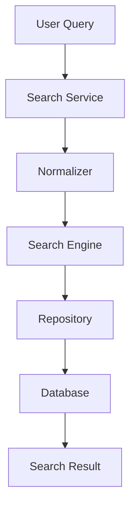

# Pharma AI Search Engine
## Enterprise Search Architecture Documentation

---

**Project Name:** Pharma AI

**Document:** Search Engine Documentation

**Document ID:** PHARMA-SEARCH-001

**Version:** 1.0.0

**Status:** Official

**Author:** Ravi Varsani

**Last Updated:** July 2026

---

# Document Classification

| Item | Value |
|------|-------|
| Type | Enterprise Technical Documentation |
| Project | Pharma AI |
| Module | Search Engine |
| Audience | Developers, Architects |
| Language | English |
| Repository | docs/SEARCH_ENGINE.md |

---

# Purpose

This document defines the official search architecture of Pharma AI.

It explains:

- Search philosophy
- Search pipeline
- Query lifecycle
- Search modules
- Ranking strategy
- Alias resolution
- Combination medicine search
- Future AI search strategy

This document is the single source of truth for all search-related development.

---

# Search Philosophy

The Search Engine is responsible only for identifying medicines.

It does **NOT**:

- Generate clinical advice
- Calculate dose adjustments
- Detect interactions
- Interpret clinical evidence

Its only responsibility is to accurately identify the medicine requested by the user.

---

# Design Goals

The Search Engine is designed to provide:

- High search accuracy
- Fast response time
- Generic-first identification
- Alias support
- Combination medicine support
- Typo tolerance
- AI-ready search pipeline

---

# Search Principles

## Principle 1

Search must always be deterministic.

The same query should return the same result when the database has not changed.

---

## Principle 2

Search must be independent of the UI.

The UI sends a query.

The Search Engine returns structured search results.

---

## Principle 3

Search never performs clinical reasoning.

Clinical processing begins only after medicine identification.

---

## Principle 4

Search must be explainable.

The engine should be able to explain why a medicine was selected.

---

# Search Pipeline Overview

```text
User Query

↓

Normalization

↓

Alias Resolution

↓

Exact Match

↓

Brand Match

↓

Generic Match

↓

Combination Match

↓

Fuzzy Match

↓

Ranking

↓

Best Result
```

---

# High-Level Architecture



---

# Search Responsibilities

The Search Engine is responsible for:

- Medicine lookup
- Alias lookup
- Exact search
- Fuzzy search
- Combination search
- Ranking
- Candidate selection

---

# Search Non-Responsibilities

The Search Engine must never:

- Recommend treatment
- Adjust dose
- Detect interactions
- Display UI
- Access clinical engines directly

---

# Search Layers

```
User

↓

Search Service

↓

Search Engine

↓

Repository

↓

Database
```

Every layer has one responsibility.

---

# Query Lifecycle

Every search request follows the same lifecycle.

```text
Receive Query

↓

Normalize

↓

Resolve Alias

↓

Search

↓

Rank

↓

Return Result
```

---

# Search Output

The Search Engine returns a structured result.

Typical information includes:

- Search Status
- Matched Medicine
- Match Type
- Confidence (if applicable)
- Search Metadata

The Search Engine never returns clinical recommendations.

---

# Runtime Requirements

The Search Engine should be:

- Fast
- Deterministic
- Testable
- Independent
- Stateless
- Easily extensible

---

# Search Quality Objectives

Primary Objective

Return the correct medicine.

Secondary Objective

Return the most relevant result.

Tertiary Objective

Return useful alternatives when appropriate.

---

# Architecture Summary

The Search Engine is the entry point to the Pharma AI runtime pipeline.

It transforms a user query into a validated medicine identity without performing any clinical reasoning.

# Query Processing Pipeline

The Search Engine processes every user query through a deterministic pipeline.

The objective is to identify the intended medicine with the highest possible accuracy while maintaining predictable behavior.

---

# Query Processing Workflow

```text
Raw User Query

↓

Input Validation

↓

Normalization

↓

Alias Resolution

↓

Exact Search

↓

Candidate Generation

↓

Result Ranking

↓

Best Match

↓

Structured Search Result
```

Every stage has one responsibility.

No stage performs clinical analysis.

---

# Query Validation

The Search Service validates user input before the search begins.

Validation includes:

- Empty query detection
- Whitespace trimming
- Invalid character handling
- Maximum query length
- Unicode normalization (future)

Invalid queries should return a structured error rather than throwing an exception.

---

# Query Normalization

Normalization converts user input into a standardized searchable format.

Typical normalization operations include:

- Trim leading/trailing whitespace
- Convert multiple spaces into one
- Case normalization
- Remove unnecessary punctuation
- Preserve combination separators
- Normalize abbreviations where supported

Example

```
PCM

↓

pcm

↓

Paracetamol
```

---

# Normalization Rules

Normalization must never change the clinical meaning of the medicine.

Allowed

```
PCM

↓

Paracetamol
```

Allowed

```
METFORMIN

↓

Metformin
```

Not Allowed

```
Paracetamol

↓

Acetaminophen
```

unless an approved alias exists.

---

# Alias Resolution

Alias resolution maps alternative medicine names to the official generic medicine.

Examples

```
PCM

↓

Paracetamol
```

```
Crocin

↓

Paracetamol
```

```
Dolo

↓

Paracetamol
```

The alias database is maintained separately from the search algorithm.

---

# Alias Philosophy

Aliases improve usability.

They should not replace the official generic name.

Runtime always continues using the official generic medicine.

---

# Alias Resolution Pipeline

```text
Normalized Query

↓

Alias Repository

↓

Official Generic Name

↓

Search Engine
```

Alias resolution should occur before exact search.

---

# Exact Search

Exact search attempts to locate an identical medicine name.

Priority

1. Generic

2. Brand

3. Product

The first valid exact match terminates the exact search stage.

---

# Exact Search Rules

Exact search should be:

- Case insensitive
- Deterministic
- Fast
- Repeatable

Exact search never performs similarity scoring.

---

# Search Candidate Generation

If no exact match is found,

the Search Engine generates candidate medicines.

Candidate sources may include:

- Generic names
- Brand names
- Combination medicines
- Approved aliases

Candidate generation should not include unrelated medicines.

---

# Search Result Structure

A successful search should provide:

- Query
- Normalized Query
- Matched Medicine
- Match Type
- Confidence (if applicable)
- Internal Identifier
- Search Duration

The result should remain independent of clinical processing.

---

# Search Status

Suggested search statuses:

SUCCESS

NO_MATCH

MULTIPLE_MATCHES

INVALID_QUERY

ERROR

Using standardized statuses simplifies downstream processing.

---

# Repository Interaction

The Search Engine retrieves data through the Repository Layer.

```text
Search Engine

↓

Repository

↓

Database
```

Direct database access from the Search Engine should be avoided.

---

# Error Handling

Search failures should return safe, structured responses.

Examples

Invalid Query

↓

Structured Error

Missing Medicine

↓

NO_MATCH

Unexpected Error

↓

ERROR

The application should remain stable regardless of search outcome.

---

# Logging Strategy

Every search request should be logged appropriately.

Recommended log entries:

- Query received
- Search stage
- Match type
- Execution time
- Exceptions

Sensitive user information should never be logged.

---

# Search Quality Principles

The Search Engine should prioritize:

1. Accuracy

2. Determinism

3. Performance

4. Maintainability

5. Explainability

Performance should never compromise correctness.

---

# Part Summary

This chapter defined:

- Query validation
- Query normalization
- Alias resolution
- Exact search
- Candidate generation
- Repository interaction
- Error handling
- Logging strategy

These components form the foundation of the Pharma AI Search Engine.

# Fuzzy Search

Fuzzy Search allows Pharma AI to identify medicines even when the user enters an incomplete or misspelled query.

Its purpose is to improve usability without compromising clinical safety.

Fuzzy Search is executed only after:

- Exact Search
- Alias Resolution
- Brand Search
- Generic Search

have failed.

---

# Fuzzy Search Philosophy

Fuzzy Search should:

- Improve user experience
- Handle spelling mistakes
- Never guess clinical information
- Always return explainable results

Fuzzy Search must never override an exact match.

---

# Fuzzy Search Pipeline

```text
Normalized Query

↓

Exact Match ?

↓

YES

↓

Return Result

↓

NO

↓

Generate Candidates

↓

Calculate Similarity

↓

Rank Candidates

↓

Threshold Filter

↓

Best Match
```

---

# Similarity Matching

The similarity algorithm compares the normalized query with searchable medicine names.

Typical candidate sources include:

- Generic Names
- Brand Names
- Approved Aliases
- Combination Medicines

The implementation should be replaceable without affecting higher application layers.

---

# Similarity Threshold

Every fuzzy match should satisfy a configurable minimum similarity threshold.

Conceptually:

```
Similarity >= Threshold

↓

Accept Candidate

Else

↓

Reject Candidate
```

The threshold should be configurable rather than hardcoded.

---

# Candidate Ranking

After candidate generation, the engine ranks possible matches.

Recommended ranking priority:

1. Exact Generic Match
2. Exact Brand Match
3. Alias Match
4. Combination Match
5. Fuzzy Generic Match
6. Fuzzy Brand Match

Only the highest ranked candidate should normally be returned.

---

# Combination Medicine Search

Combination medicines require specialized handling.

Examples

```
Aceclofenac + Paracetamol

Amoxicillin + Clavulanic Acid

Telmisartan + Hydrochlorothiazide
```

The search engine should preserve combination structure during normalization.

---

# Combination Search Pipeline

```text
Normalize Query

↓

Identify Combination

↓

Split Components

↓

Normalize Components

↓

Search Individual Components

↓

Reconstruct Combination

↓

Rank Result
```

Combination parsing should be deterministic.

---

# Component Matching

Each component should be evaluated independently.

Example

```
Aceclofenac

+

Paracetamol
```

↓

```
Component 1

Matched

Component 2

Matched
```

↓

Combination Identified

---

# Ranking Strategy

Multiple candidates should be ranked according to defined business rules.

Recommended ranking factors include:

- Exactness
- Alias Resolution
- Component Match
- Similarity Score
- Preferred Generic

Ranking rules should remain consistent across releases.

---

# Confidence Model

Every search result may include an optional confidence score.

Example

```
Exact Match

↓

100%
```

```
Alias Match

↓

Very High
```

```
Fuzzy Match

↓

Moderate
```

Confidence should be interpreted as search confidence only.

It is **not** a measure of clinical certainty.

---

# Multiple Matches

If multiple medicines receive equivalent ranking,

the Search Engine should return a structured response indicating ambiguity.

Example

```
MULTIPLE_MATCHES
```

The application may then request user clarification.

---

# No Match Scenario

If no suitable candidate satisfies the acceptance criteria,

the Search Engine returns:

```
NO_MATCH
```

No medicine should be guessed.

---

# Explainable Search

Every successful search should be explainable.

Example explanation metadata:

- Match Type
- Search Stage
- Normalized Query
- Selected Identifier

This metadata is useful for debugging, testing, and future AI explainability.

---

# Search Safety Rules

The Search Engine shall never:

- Guess medicines
- Ignore exact matches
- Replace approved aliases
- Perform clinical reasoning
- Invent search results

Patient safety always takes precedence over convenience.

---

# Performance Considerations

The search implementation should prioritize:

- O(1) dictionary lookups where applicable
- Cached reference datasets
- Minimal repeated normalization
- Efficient candidate filtering

Performance optimizations must not alter search correctness.

---

# Extension Points

The Search Engine should remain extensible for future capabilities such as:

- Voice Search
- OCR Input
- Gujarati Medicine Search
- Hindi Medicine Search
- Phonetic Search
- Semantic Search
- AI-assisted Query Interpretation

These extensions should integrate without changing the core search architecture.

---

# Part Summary

This chapter defines:

- Fuzzy Search
- Candidate Generation
- Ranking Strategy
- Combination Search
- Confidence Model
- Explainable Search
- Performance Guidelines
- Future Search Extensions

These capabilities ensure that Pharma AI provides accurate, explainable, and extensible medicine identification while preserving clinical safety.

# Search Performance Architecture

The Pharma AI Search Engine is designed to provide fast, deterministic, and scalable medicine identification.

Performance improvements must never compromise search correctness.

The primary performance goal is to minimize search latency while maintaining explainable results.

---

# Performance Objectives

The Search Engine should achieve:

- Low search latency
- Predictable execution time
- Minimal memory allocation
- Efficient candidate selection
- Stable runtime behavior

Performance should be measured rather than assumed.

---

# Repository Integration

The Search Engine never accesses CSV files directly.

All database operations must be delegated to the Repository Layer.

Architecture

```text
Search Engine

↓

Repository

↓

Database Service

↓

Production Master CSV
```

Benefits

- Storage independence
- Easier testing
- Better maintainability
- Reduced coupling

---

# Runtime Caching Strategy

Reference datasets may be cached during application startup.

Suitable candidates include:

- Generic Master
- Brand Master
- Alias Master
- Product Master

Clinical datasets should follow their own loading strategy.

Caching reduces repeated disk access.

---

# Cache Design Principles

Caches should be:

- Read-only
- Immutable during runtime
- Reloadable after database updates
- Independent of UI

Cache invalidation should occur only after an approved database refresh.

---

# Search Index

The Search Engine may maintain optimized lookup indexes.

Typical indexes include:

- Generic Name Index
- Brand Name Index
- Alias Index
- Product Index
- Combination Index

Indexes improve lookup performance without changing source data.

---

# Execution Flow

```text
Receive Query

↓

Validate

↓

Normalize

↓

Repository Lookup

↓

Candidate Selection

↓

Ranking

↓

Result Construction

↓

Return
```

Each stage should execute independently.

---

# Error Handling

Expected search outcomes

- SUCCESS
- NO_MATCH
- MULTIPLE_MATCHES
- INVALID_QUERY

Unexpected failures should:

- Log the exception
- Preserve diagnostic information
- Return a safe error response

Search failures must never terminate the application.

---

# Logging Policy

Recommended log events:

INFO

- Search started
- Match found
- Execution time

WARNING

- Ambiguous search
- Multiple matches

ERROR

- Repository failure
- Unexpected exception

DEBUG

- Candidate generation
- Ranking details
- Similarity scores

Debug logging should be disabled in production releases.

---

# Performance Metrics

Recommended metrics include:

- Search latency
- Average execution time
- Cache hit rate
- Exact match rate
- Alias match rate
- Fuzzy match rate
- No-match frequency

Metrics support continuous optimization.

---

# Benchmark Strategy

Performance benchmarks should include:

Dataset Sizes

- Small
- Medium
- Large

Query Types

- Exact
- Alias
- Brand
- Combination
- Fuzzy

Measurements

- Average latency
- Worst-case latency
- Memory usage
- Throughput

Benchmarks should be repeatable.

---

# Scalability Guidelines

The Search Engine should remain efficient as the database grows.

Target scalability:

- Hundreds of medicines
- Thousands of medicines
- Tens of thousands of medicines

Algorithmic complexity should be reviewed before introducing new search strategies.

---

# Thread Safety

Search operations should avoid modifying shared runtime state.

Reference datasets should remain read-only during request processing.

This simplifies concurrent execution and future parallelization.

---

# Unit Testing Strategy

Every search stage should be independently testable.

Suggested unit test coverage:

- Query validation
- Normalization
- Alias resolution
- Exact search
- Combination search
- Fuzzy search
- Ranking
- Error handling

Unit tests should not require the UI.

---

# Integration Testing

Integration tests should verify:

- Repository communication
- Database service interaction
- End-to-end search
- Structured search result

Integration tests should use validated production datasets whenever possible.

---

# Regression Testing

Regression testing should ensure that:

- Existing search behavior is preserved.
- Ranking remains stable.
- Alias resolution remains correct.
- Performance does not degrade unexpectedly.

Every search improvement should include regression verification.

---

# Monitoring

Future production deployments may monitor:

- Search latency
- Error frequency
- Cache utilization
- Query distribution

Monitoring data should support engineering decisions rather than replacing testing.

---

# Search Engine Engineering Principles

The implementation should remain:

- Deterministic
- Stateless
- Explainable
- Modular
- Testable
- Maintainable
- Performance-aware

Correctness always takes priority over speed.

---

# Part Summary

This chapter defines the engineering expectations for the Search Engine.

Topics covered include:

- Repository integration
- Runtime caching
- Performance metrics
- Logging
- Error handling
- Benchmarking
- Unit testing
- Regression testing
- Scalability
- Monitoring

These practices ensure that the Search Engine remains reliable, maintainable, and ready for future growth.

# Current Search Architecture

The current Pharma AI Search Engine is designed as a deterministic medicine identification system.

Current responsibilities include:

- Query processing
- Medicine identification
- Alias resolution
- Generic search
- Brand search
- Product search
- Combination medicine support
- Structured search results

Clinical interpretation is intentionally excluded from the Search Engine.

---

# Current Runtime Flow

```text
User Query

↓

Smart Search Service

↓

Search Engine

↓

Repository

↓

Database Service

↓

Medicine Record

↓

Return Result
```

The Clinical Engine is invoked only after successful medicine identification.

---

# Current Design Constraints

The current implementation follows the following constraints.

✓ Stateless Search

✓ Repository-based Data Access

✓ Deterministic Results

✓ Generic-first Architecture

✓ Layer Separation

These constraints should remain stable.

---

# Enterprise Search Rules

The following engineering rules apply to every future change.

---

## Rule 1

Search identifies medicines.

Clinical modules interpret medicines.

Responsibilities must never overlap.

---

## Rule 2

Repositories remain the only supported data access layer.

Search modules should never access CSV files directly.

---

## Rule 3

Search algorithms should remain independent from UI implementation.

---

## Rule 4

Search logic should remain independent from AI implementation.

AI should consume search results—not replace them.

---

## Rule 5

Search correctness has higher priority than search speed.

Incorrect fast search is worse than correct slow search.

---

# Architecture Freeze

The following components are considered stable.

- Search Service
- Repository Contract
- Search Result Model
- Database Interface

Any modification requires architectural review.

---

# Future Enhancements (Phase 19+)

The following capabilities are planned for future releases.

## Voice Search

Support medicine search using speech recognition.

---

## OCR Search

Search medicines directly from prescription images.

---

## Gujarati Search

Support medicine names entered in Gujarati script.

---

## Hindi Search

Support medicine names entered in Hindi script.

---

## Phonetic Search

Improve search for pronunciation-based spelling variations.

---

## Semantic Search

Understand user intent rather than exact wording.

---

## AI-assisted Query Interpretation

Use AI to improve query understanding while preserving deterministic medicine identification.

AI should suggest candidates but must not bypass repository validation.

---

# AI Integration Strategy

Future AI integration should follow this architecture.

```text
User Query

↓

Search Engine

↓

Medicine Identity

↓

AI Context

↓

Clinical Reasoning

↓

Recommendation

↓

Explanation
```

AI should operate only after medicine identification.

---

# Release Policy

Every Search Engine modification requires:

✓ Code Review

✓ Unit Testing

✓ Integration Testing

✓ Regression Testing

✓ Performance Benchmark

✓ Documentation Update

---

# Definition of Done

A Search Engine task is complete only if:

✓ Code Review Passed

✓ Build Successful

✓ Validation Passed

✓ Regression Tests Passed

✓ Documentation Updated

✓ CHANGELOG Updated

✓ Git Commit Completed

---

# Search Engineering Checklist

Before every release verify:

- Search accuracy unchanged
- Alias resolution verified
- Combination search verified
- Performance benchmark completed
- Regression test passed
- Repository integration verified

---

# Search Module Ownership

| Component | Owner |
|------------|--------|
| Search Service | Services Layer |
| Search Engine | Search Layer |
| Repository | Repository Layer |
| Database Access | Database Service |
| Clinical Processing | Clinical Layer |

Responsibilities must remain clearly separated.

---

# Search Design Summary

The Pharma AI Search Engine is designed to provide:

- Accurate medicine identification
- Deterministic behavior
- Modular architecture
- Repository-based data access
- Explainable search results
- Enterprise scalability

Its primary goal is reliable medicine identification rather than clinical interpretation.

---

# References

Related Documents

- ARCHITECTURE.md
- DATABASE.md
- CLINICAL_ENGINE.md
- BUILDER_FRAMEWORK.md
- VALIDATION_FRAMEWORK.md

---

# Approval

Document Status

Approved

Version

1.0.0

Owner

Pharma AI Project

Location

docs/SEARCH_ENGINE.md

This document serves as the official Search Engine architecture reference for Pharma AI.
