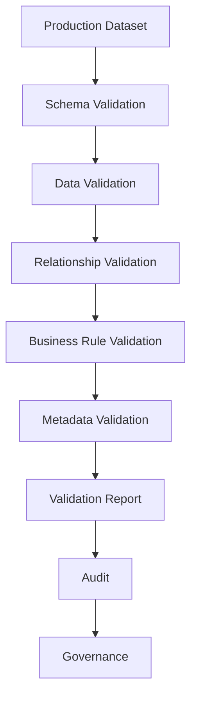

# Pharma AI Validation Framework
## Enterprise Data Validation Documentation

---

**Project Name:** Pharma AI

**Document:** Validation Framework Documentation

**Document ID:** PHARMA-VALIDATION-001

**Version:** 1.0.0

**Status:** Official

**Author:** Ravi Varsani

**Last Updated:** July 2026

---

# Document Classification

| Item | Value |
|------|-------|
| Type | Enterprise Technical Documentation |
| Module | Validation Framework |
| Audience | Developers, QA Engineers, Data Engineers |
| Repository | docs/VALIDATION_FRAMEWORK.md |

---

# Purpose

The Validation Framework ensures that every production dataset used by Pharma AI is structurally correct, logically consistent, and clinically safe before it is released.

It is the mandatory quality gate between the Builder Framework and the Governance Framework.

No production dataset may bypass validation.

---

# Validation Philosophy

Validation is based on one fundamental principle:

> **Incorrect data must never reach production.**

Validation is preventive rather than corrective.

Validators identify problems.

Builders correct them.

Governance decides whether release is allowed.

---

# Validation Objectives

The Validation Framework is designed to:

- Protect database integrity
- Prevent invalid production releases
- Detect structural errors
- Detect logical inconsistencies
- Verify business rules
- Produce measurable quality metrics

---

# Validation Position in Architecture

```text
Input CSV

↓

Builder

↓

Production CSV

↓

Validation Framework

↓

Audit

↓

Governance

↓

Production Release
```

Validation executes after every Builder.

---

# Validation Architecture



---

# Validation Categories

The Validation Framework is divided into five major categories.

| Category | Purpose |
|-----------|----------|
| Schema Validation | Structure verification |
| Data Validation | Data quality verification |
| Relationship Validation | Foreign key integrity |
| Business Rule Validation | Project rules |
| Metadata Validation | Traceability verification |

Each category produces independent validation results.

---

# Validation Principles

## Principle 1

Validation MUST be deterministic.

The same dataset should always produce the same validation result.

---

## Principle 2

Validation MUST be read-only.

Validators never modify production datasets.

---

## Principle 3

Validation MUST be reproducible.

Repeated validation produces identical results.

---

## Principle 4

Validation MUST be explainable.

Every validation failure should include:

- Rule violated
- Dataset
- Record
- Reason

---

## Principle 5

Validation MUST complete before Audit.

Audit assumes validated production data.

---

# Validator Responsibilities

Validators are responsible for:

- Checking production datasets
- Detecting errors
- Calculating quality metrics
- Producing validation reports

Validators are NOT responsible for:

- Repairing datasets
- Generating production data
- Clinical decision making
- Governance approval

---

# Validation Lifecycle

```text
Builder Output

↓

Load Dataset

↓

Execute Validators

↓

Collect Findings

↓

Calculate Statistics

↓

Generate Validation Report

↓

Return Result
```

Validation should stop immediately on critical structural failures.

---

# Validation Output

Each validator should generate a structured result.

Typical contents:

- Validation Status
- Total Records
- Passed Rules
- Failed Rules
- Errors
- Warnings
- Statistics

This output becomes the input for the Audit Framework.

---

# Validation Scope

The Validation Framework applies to:

- Medicine Master Tables
- Product Tables
- Mapping Tables
- ATC Tables
- Clinical Tables

Every production dataset must pass validation before release.

---

# Validation Framework Summary

The Validation Framework is the primary quality assurance mechanism of Pharma AI.

Its role is to verify that production datasets are accurate, complete, consistent, and ready for audit and governance review.

# Schema Validation

Schema Validation is the first stage of the Validation Framework.

Its purpose is to verify that every production dataset follows the official project schema before any business validation begins.

Schema validation failures are considered critical.

---

# Validation Pipeline

```text
Load Dataset

↓

Schema Validation

↓

Required Column Validation

↓

Data Validation

↓

Relationship Validation

↓

Business Rule Validation

↓

Metadata Validation
```

Schema validation MUST complete successfully before proceeding.

---

# Schema Validation Objectives

Schema Validation verifies:

- Dataset exists
- Required columns exist
- Column names are correct
- Column count is correct
- Mandatory identifiers exist

Schema validation does not verify business logic.

---

# Required Column Validation

Every production dataset has an official schema.

Validators MUST verify that all required columns are present.

Example

```text
generic_master.csv

↓

Generic_ID

Generic_Name

Status

created_at

updated_at

source

version
```

Missing required columns immediately fail validation.

---

# Optional Columns

Datasets may contain optional columns where defined by the project standard.

Validators should:

- Ignore missing optional columns
- Validate optional columns if present

Optional columns must never replace mandatory fields.

---

# Column Name Validation

Column names MUST exactly match the official project schema.

Incorrect

```
genericid
```

Correct

```
Generic_ID
```

Column naming consistency is required across all datasets.

---

# Column Order

Current implementation:

Column order is preserved by Builders.

Future recommendation:

Column order should remain consistent for readability and version control.

Column order alone should not determine dataset validity unless explicitly required.

---

# Dataset Existence Validation

Before loading,

Validators MUST verify:

✓ File exists

✓ File is readable

✓ File is not empty

Failure at this stage terminates validation.

---

# Empty Dataset Validation

A dataset containing headers but no records should be evaluated separately.

Possible outcomes:

- Valid but empty (where allowed)
- Invalid (where records are mandatory)

Dataset-specific rules determine acceptance.

---

# Missing Value Validation

Missing values are evaluated after schema validation.

Validators should detect:

- Null values
- Empty strings
- Missing identifiers
- Missing mandatory metadata

Required fields must never contain missing values.

---

# Duplicate Record Validation

Duplicate detection protects production data integrity.

Validation categories:

- Duplicate IDs
- Duplicate logical entities
- Duplicate mapping relationships

Each category should be reported independently.

---

# Duplicate Identifier Validation

Every identifier must be unique.

Example

```
GEN000001

GEN000001
```

↓

Validation Failure

Duplicate primary identifiers are critical errors.

---

# Duplicate Logical Entity Validation

Logical duplicates should also be detected.

Example

```
Paracetamol

Paracetamol
```

↓

Duplicate Generic

Logical duplicates may exist even when IDs differ.

---

# Duplicate Mapping Validation

Mapping datasets should prevent duplicate relationships.

Example

```
GEN000001

↓

ATC000001
```

appearing twice represents a duplicate mapping.

---

# Data Type Validation

Where applicable,

Validators should verify expected data formats.

Examples:

- Date fields
- Version fields
- Numeric values
- Controlled vocabulary

Validation rules should remain consistent across datasets.

---

# Controlled Vocabulary Validation

Certain fields must use approved values only.

Examples

Status

```
Active

Inactive
```

Severity

```
Critical

Major

Moderate

Minor

Information
```

Unexpected values should generate validation failures.

---

# Validation Findings

Each validation rule produces one of:

PASS

WARNING

FAIL

Only FAIL results should block production release unless governance policy specifies otherwise.

---

# Validation Report Structure

Each validator should report:

- Dataset
- Validation Rule
- Status
- Error Count
- Warning Count
- Details

Reports should remain machine-readable and human-readable.

---

# Part Summary

This chapter defines:

- Schema Validation
- Required Columns
- Optional Columns
- Dataset Validation
- Missing Values
- Duplicate Detection
- Controlled Vocabulary
- Validation Findings
- Validation Reports

These rules establish the structural quality standards for every Pharma AI production dataset.

# Relationship Validation

Relationship Validation ensures that all production datasets maintain referential integrity.

Every foreign key MUST reference an existing master record.

Relationship validation executes after successful schema validation.

---

# Foreign Key Validation

Foreign keys connect production datasets.

Validators MUST verify that every referenced identifier exists.

Example

```text
Brand Master

↓

Generic_ID

↓

Generic Master
```

If the referenced Generic_ID does not exist,

validation MUST fail.

---

# Foreign Key Relationships

Typical production relationships include:

| Child Dataset | Parent Dataset |
|---------------|----------------|
| Brand Master | Generic Master |
| Product Master | Generic Master |
| Generic ATC Mapping | Generic Master |
| Generic ATC Mapping | ATC Master |
| Clinical Tables | Generic Master |

All relationships must remain valid.

---

# Orphan Record Detection

An orphan record references a missing parent entity.

Example

```
Product

↓

GEN999999

↓

Generic not found
```

↓

Validation FAIL

Orphan records are not permitted.

---

# Mapping Integrity Validation

Mapping datasets require additional validation.

Example

```
GEN000001

↓

ATC000001
```

Validation checks:

✓ Generic exists

✓ ATC exists

✓ Mapping unique

✓ Mapping active

---

# Clinical Relationship Validation

Clinical datasets should reference valid medicine entities.

Current implementation may reference:

- Generic_Name

Future architecture should standardize on:

- Generic_ID

This improves referential integrity and simplifies repository design.

---

# Business Rule Validation

Business Rule Validation verifies project-specific rules beyond structural correctness.

Examples include:

- Approved severity values
- Approved evidence levels
- Valid pregnancy categories
- Valid dosage forms
- Approved routes
- Approved schedules

Business rules protect semantic correctness.

---

# Controlled Value Validation

Fields using controlled vocabularies MUST contain approved values only.

Examples:

Status

```
Active

Inactive
```

Severity

```
Critical

Major

Moderate

Minor

Information
```

Unexpected values generate validation failures.

---

# Metadata Validation

Every production dataset must include standard metadata.

Required metadata:

- Status
- created_at
- updated_at
- source
- version

Validators verify:

✓ Presence

✓ Format

✓ Consistency

---

# Timestamp Validation

Timestamp fields should satisfy project standards.

Examples

```
created_at

updated_at
```

Validation checks:

- Present
- Valid format
- Chronologically consistent (where applicable)

---

# Source Validation

Every production record should identify its origin.

Typical value:

```
Pharma AI
```

Future integrations may introduce additional approved sources.

---

# Version Validation

Dataset version values should remain consistent across a production release.

Example

```
1.0
```

Mixed versions within the same production dataset should be investigated.

---

# Validation Statistics

Every validator should calculate execution statistics.

Typical metrics:

- Total Records
- Valid Records
- Invalid Records
- Duplicate Records
- Missing Values
- Foreign Key Errors
- Validation Time

Statistics support engineering monitoring.

---

# Health Score Framework

The Health Score summarizes dataset quality.

It is a governance metric,

not a replacement for individual validation results.

---

# Recommended Health Score Components

| Validation Area | Example Weight |
|-----------------|----------------|
| Schema Validation | 20% |
| Missing Values | 15% |
| Duplicate Detection | 20% |
| Foreign Key Validation | 20% |
| Business Rules | 15% |
| Metadata Validation | 10% |

**Note:** These weights are architecture recommendations. If the project defines official weights in code (for example, your existing audit implementation), those implementation values take precedence.

---

# Health Score Grades

Suggested interpretation:

| Score | Grade |
|--------|-------|
| 95–100 | Excellent |
| 90–94 | Very Good |
| 80–89 | Good |
| 70–79 | Acceptable |
| Below 70 | Release Blocked |

Governance determines the minimum acceptable production score.

---

# Validation Result

Every validator should return a structured result.

Logical contents:

- Validation Status
- Errors
- Warnings
- Statistics
- Health Score
- Summary

This result becomes the input for the Audit and Governance Frameworks.

---

# Current Implementation

Current Pharma AI validation includes dedicated validators for:

- Interaction
- Contraindication
- Warning
- Evidence
- Renal
- Hepatic
- Monitoring

Additional validators may be added following the same framework.

---

# Future Enhancements

Future improvements may include:

- Cross-dataset validation
- Rule configuration files
- Incremental validation
- Parallel validator execution
- Validation dashboard
- Automated regression comparison

Future enhancements must preserve deterministic validation behavior.

---

# Part Summary

This chapter defines:

- Foreign Key Validation
- Relationship Integrity
- Business Rule Validation
- Metadata Validation
- Validation Statistics
- Health Score Framework
- Validation Results
- Current Implementation
- Future Enhancements

These standards ensure that Pharma AI production datasets are structurally correct, logically consistent, and suitable for governance approval.

# Validation Reporting Framework

Every validator MUST produce a structured validation report.

The report serves three purposes:

- Developer feedback
- Audit input
- Governance decision support

Reports should be consistent across all validators.

---

# Validation Report Lifecycle

```text
Production Dataset

↓

Validator

↓

Validation Findings

↓

Statistics

↓

Health Score

↓

Validation Report

↓

Audit Framework
```

Validation reports should be generated automatically after every validation run.

---

# Report Structure

Every validation report should contain:

## General Information

- Validator Name
- Dataset Name
- Validation Date
- Validation Version

---

## Validation Summary

- Status
- Total Records
- Passed Rules
- Failed Rules
- Warnings

---

## Statistics

- Processing Time
- Total Errors
- Missing Values
- Duplicate Records
- Foreign Key Errors

---

## Health Score

- Overall Score
- Grade
- Recommendation

---

## Detailed Findings

Every validation failure should include:

- Rule
- Dataset
- Record Identifier
- Error Description
- Suggested Resolution

This structure improves debugging and traceability.

---

# Logging Framework

Validators MUST generate structured logs.

Recommended logging levels:

INFO

- Validation started
- Dataset loaded
- Validation completed

WARNING

- Optional field missing
- Deprecated value detected
- Non-critical inconsistencies

ERROR

- Missing required column
- Invalid relationship
- Corrupted dataset
- Validation failure

DEBUG

- Rule execution
- Internal statistics
- Validation timing

Verbose DEBUG logging should be disabled in production.

---

# Error Handling Strategy

Expected validation failures include:

- Missing file
- Missing required column
- Duplicate records
- Invalid metadata

Unexpected failures include:

- Runtime exceptions
- Corrupted input
- Parser failures

Unexpected failures should:

- Stop validation safely
- Preserve diagnostic information
- Return a structured error result

Validators should never terminate the application unexpectedly.

---

# Failure Classification

Validation findings should be classified consistently.

Suggested categories:

| Level | Description |
|---------|-------------|
| ERROR | Blocks release |
| WARNING | Review recommended |
| INFO | Informational |

Governance determines how each category affects release approval.

---

# Performance Guidelines

Validation should prioritize:

- Correctness
- Deterministic behavior
- Clear reporting
- Efficient processing

Optimization should never reduce validation quality.

---

# Performance Metrics

Recommended metrics:

- Validation Duration
- Records Processed
- Rules Executed
- Errors Detected
- Warnings Generated
- Memory Usage (optional)

These metrics support continuous improvement.

---

# Testing Strategy

Every validator MUST be tested independently.

Recommended test coverage:

- Schema Validation
- Required Columns
- Missing Values
- Duplicate Detection
- Foreign Keys
- Business Rules
- Metadata Validation

Unit tests should isolate individual validation rules.

---

# Integration Testing

Integration tests verify interaction with:

- Builder Framework
- Audit Framework
- Governance Framework

Validation should be tested using production-style datasets whenever possible.

---

# Regression Testing

Regression testing ensures:

- Existing validation rules remain unchanged
- Health Score calculation remains stable
- Reports remain consistent
- No unintended behavior changes occur

Regression tests should accompany every validation framework change.

---

# Maintainability

Validators should be:

- Modular
- Independent
- Reusable
- Easy to extend

Common validation utilities should be shared whenever possible.

---

# Current Implementation

Current Pharma AI validation includes:

- Dataset-specific validators
- Validation statistics
- Health score calculation
- Structured console output
- Validation reports

These components form the current production validation framework.

---

# Architecture Standard

The Validation Framework is the official quality gate between the Builder Framework and Governance.

Every production dataset MUST pass validation before entering the Audit Framework.

---

# Future Enhancements

Planned improvements include:

- Configurable validation rules
- Cross-dataset validation
- Validation dashboards
- Parallel validation execution
- Historical validation trends
- CI/CD validation integration

Future enhancements should remain compatible with the current validation architecture.

---

# Part Summary

This chapter defines:

- Validation Reports
- Logging Framework
- Error Handling
- Performance Guidelines
- Testing Strategy
- Regression Testing
- Maintainability
- Current Implementation
- Architecture Standard
- Future Enhancements

These engineering practices ensure that Pharma AI validators remain reliable, maintainable, and production-ready.

# Enterprise Validation Rules

The following rules are mandatory for every validation process within Pharma AI.

These rules ensure production quality, consistency, and regulatory traceability.

---

## Rule 1 — Read-Only Validation

Validators MUST never modify production datasets.

Validation is an inspection process.

Correction belongs to the Builder Framework.

---

## Rule 2 — Deterministic Execution

Given:

- Same dataset
- Same validator version
- Same validation rules

The validation result MUST be identical.

---

## Rule 3 — Complete Validation

All required validation stages MUST execute unless a critical structural failure prevents further processing.

Validation should not silently skip rules.

---

## Rule 4 — Explainable Results

Every validation failure MUST include:

- Validation Rule
- Dataset
- Record Identifier
- Failure Reason
- Severity

Validation results should always be traceable.

---

## Rule 5 — Validation Before Audit

Audit Framework MUST receive only validated datasets.

Audit should never replace validation.

---

# Validation Lifecycle

The official validation lifecycle is:

```text
Builder

↓

Production Dataset

↓

Validation

↓

Validation Report

↓

Audit

↓

Audit Report

↓

Governance

↓

Production Release
```

This lifecycle is mandatory for every production release.

---

# Governance Integration

Validation provides objective quality information.

Governance evaluates that information before approving a release.

Relationship

```text
Validation

↓

Audit

↓

Governance

↓

Release Decision
```

Validation itself never approves or rejects releases.

---

# Release Policy

A production dataset may be released only if:

✓ Validation PASS

✓ Audit PASS

✓ Health Score acceptable

✓ Governance approval

✓ Documentation updated

✓ CHANGELOG updated

---

# Validation Decision Matrix

| Validation Result | Action |
|-------------------|--------|
| PASS | Continue to Audit |
| WARNING | Review Required |
| FAIL | Release Blocked |

Governance determines whether WARNING conditions require manual approval.

---

# Validation Checklist

Before approving validation results verify:

- Required columns verified
- Missing values checked
- Duplicate records checked
- Foreign keys verified
- Business rules verified
- Metadata verified
- Validation report generated
- Health score calculated

Every item should be completed before Audit begins.

---

# Validation Versioning

Validators should follow Semantic Versioning.

```
MAJOR.MINOR.PATCH
```

Examples:

```
2.0.0

1.5.0

1.5.3
```

Version changes should be documented in the project CHANGELOG.

---

# Documentation Standard

Every validator should include:

- Purpose
- Input datasets
- Validation rules
- Output
- Error conditions
- Limitations
- Example execution

Documentation must remain synchronized with implementation.

---

# Current Implementation

Current Pharma AI Validation Framework includes:

- Dataset-specific validators
- Required column validation
- Missing value validation
- Duplicate detection
- Foreign key validation
- Metadata validation
- Health score calculation
- Structured validation reports

This represents the current production implementation.

---

# Architecture Standard

The Validation Framework is the official quality gate for all production datasets.

Every Builder output MUST pass through this framework before Governance review.

No production dataset may bypass validation.

---

# Future Enhancements

Planned improvements include:

- Rule configuration engine
- Cross-dataset consistency validation
- Historical quality trend analysis
- Automated regression comparison
- Validation dashboard
- CI/CD pipeline integration
- Machine-readable validation APIs

Future enhancements must remain compatible with the current validation architecture.

---

# Related Documents

This document should be read together with:

- ARCHITECTURE.md
- DATABASE.md
- BUILDER_FRAMEWORK.md
- GOVERNANCE.md

Together these documents define the complete Pharma AI production quality pipeline.

---

# Validation Framework Summary

The Pharma AI Validation Framework protects production quality by ensuring that every dataset is:

- Structurally correct
- Logically consistent
- Referentially valid
- Business-rule compliant
- Fully traceable

Validation is the mandatory quality gate before Audit and Governance.

---

# Approval

Document Status

Approved

Version

1.0.0

Owner

Pharma AI Project

Location

docs/VALIDATION_FRAMEWORK.md

This document serves as the official Validation Framework reference for all current and future Pharma AI development.